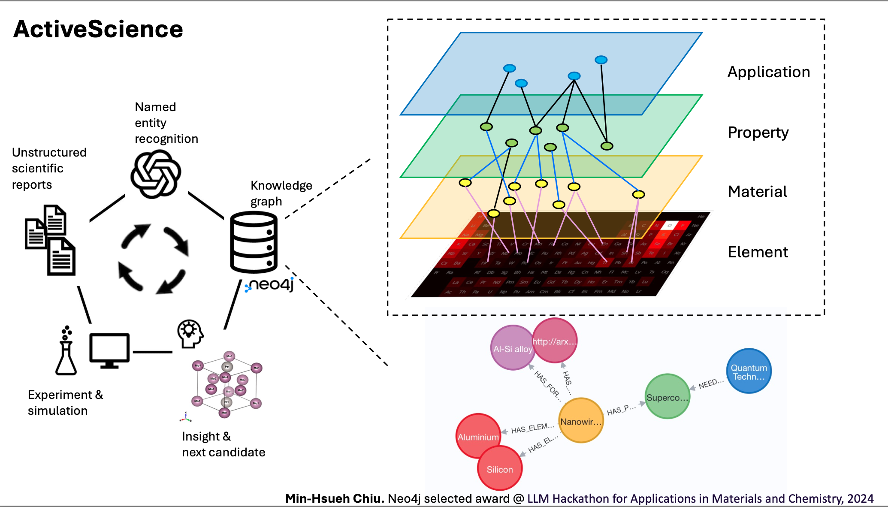
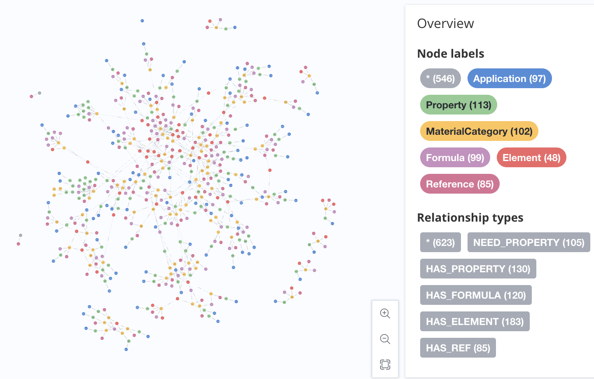
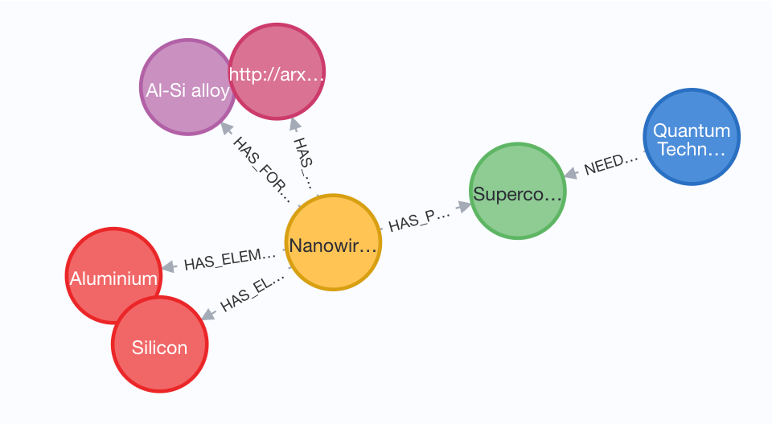

# ActiveScience

## Introduction

**How can we explore the vast chemical space with limited computational and experimental resources?** The chemical space is estimated to be as large as 1060 compounds. Even with computational resources capable of performing 1060 simulations per year, it would take 1030 years to fully explore this space. Domain experts, although skilled at identifying potential chemical candidates, typically focus on a narrow range of materials, resulting in incremental improvements. Moreover, existing databases primarily contain intrinsic material properties without application-specific information, which hinders the discovery of new materials. Their predefined schemas further restrict the identification of hidden relationships. This raises a critical question: **is there a way to construct a comprehensive overview of the currently discovered data?**

To solve this question, I utilize scientific reports, a large language model, and a knowledge graph. Scientific reports often contain hidden relationships and entities not recorded in traditional databases, offering a richer source of information. Large language models have demonstrated reliable text summarization abilities, making it easier to extract relevant data from these reports. Finally, knowledge graphs can effectively illustrate knowledge ingestion and discovery, helping to construct a comprehensive overview of the current data and uncover new insights.

In this framework, I construct **an automatic pipeline to generate a knowledge graph from unstructured scientific reports.** The basic modules in ActiveScience—article input, large language model, and knowledge graph implementation—are adaptable to various implementations. For instance, while this demonstration uses ChatGPT 3.5, it can be modified to incorporate domain-specific large language models. Additionally, the granularity of the knowledge graph can vary based on the input articles, allowing for flexibility in topic depth. This framework is versatile, serving not only researchers but also educational purposes, providing a valuable tool for knowledge extraction and dissemination across different fields.

The visualization of the constructed knowledge graph.

The visualization of the sub-knowledge graph from https://arxiv.org/abs/2207.05343v1.

## Futrue works

As this work aims to demonstrate the fundamental pipeline of ActiveScience, here are several points to improve model accuracy for actual utility:

1. Utilize more stringent journal papers as input data sources, as the quality of pre-print articles varies due to the lack of peer review.
2. Employ domain-specific large language models to enhance entity and relationship recognition.
3. Perform entity resolution to eliminate duplication and create a concise knowledge graph.

### Prerequisites

- Python 3.9 or above
- Neo4j
